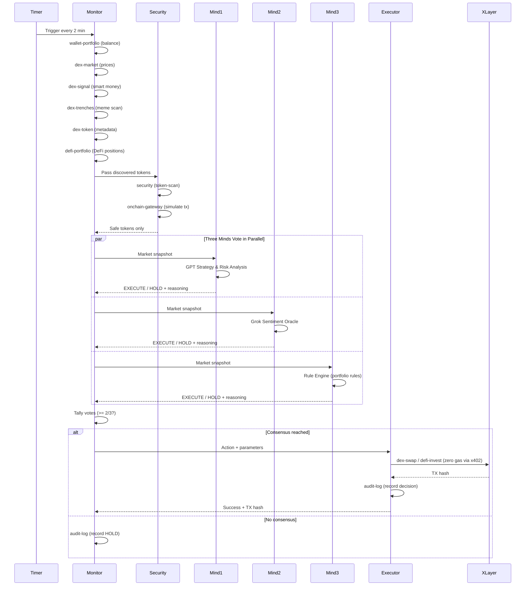
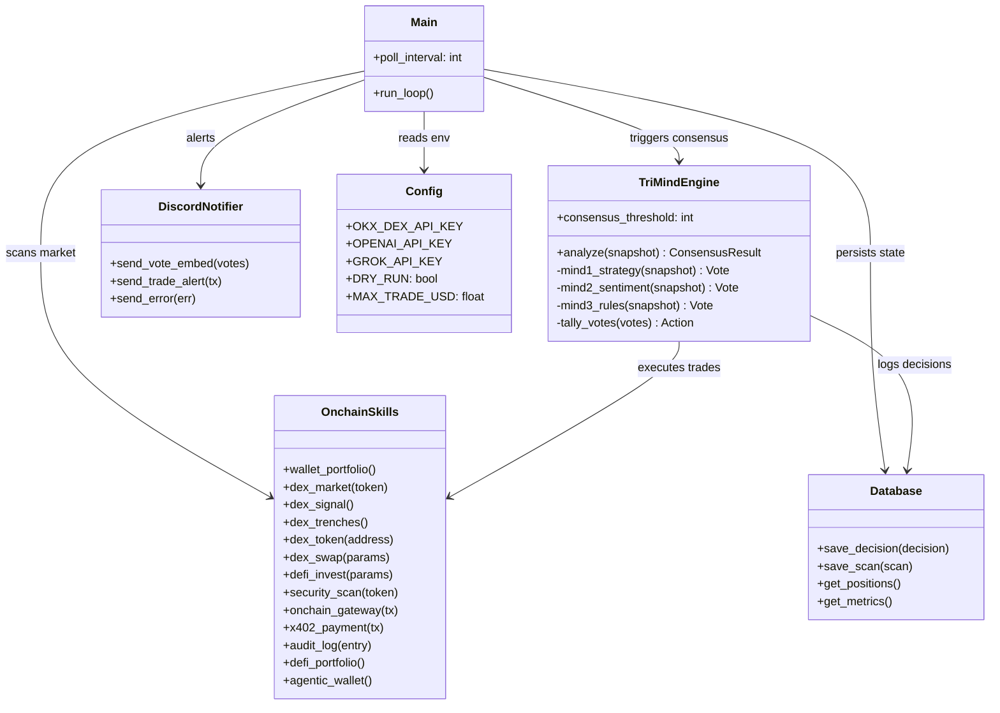

-black?logo=data:image/svg+xml;base64,)


# TriMind Agent

### Three Minds. One Consensus. Zero Gas.

> Autonomous AI DeFi agent deployed on OKX X Layer that uses **all 13 OnchainOS skills** with a multi-AI consensus engine -- three independent AI minds must agree before any on-chain execution.

**Track**: X Layer Arena | **Hackathon**: OKX Build-X 2026 | **Chain**: X Layer (196)

---

## How It Works

Every 2 minutes, TriMind runs an autonomous decision loop:

```
  Scan X Layer DeFi via OnchainOS (13 skills)
          |
          v
  +-------------------+
  |   Mind 1           |  "Idle USDC should earn yield on Aave"  --> EXECUTE
  |   Strategy & Risk  |
  +-------------------+
          |
  +-------------------+
  |   Mind 2           |  "No risk signals, best to supply Aave" --> EXECUTE  
  |   Sentiment Oracle |
  +-------------------+
          |
  +-------------------+
  |   Mind 3           |  "Idle funds detected, safe conditions" --> EXECUTE
  |   Rule Engine      |
  +-------------------+
          |
          v
  Consensus: 3/3 --> EXECUTE
  $17.14 USDC swapped autonomously on X Layer (zero gas)
```

**2 out of 3 minds must agree before ANY on-chain action.** No single AI controls the wallet.

## Why Multi-AI Consensus?

Most AI trading agents rely on a single LLM to make decisions. This creates a single point of failure -- one hallucination, one bad prompt injection, or one model blind spot can drain a wallet.

TriMind solves this with **independent multi-AI consensus**:

| Problem | Single-AI Agent | TriMind (Multi-AI) |
|---------|----------------|-------------------|
| LLM hallucination | Executes bad trade | Outvoted 2-to-1, trade blocked |
| Prompt injection | Wallet drained | Other minds reject malicious action |
| Model blind spot | Missed risk signal | Different models catch different risks |
| Overconfidence | YOLO trades | Conservative consensus dampens extremes |

Each mind uses a **different LLM backend** (GPT, Grok, rule-based logic) so they fail independently. The consensus threshold is configurable -- set to 2/3 for normal operation or 3/3 for maximum safety.

This is the same principle behind multi-sig wallets, but applied to AI decision-making.

## Decision Loop (Sequence Diagram)



## Architecture



## Project Structure

```
src/
  main.py                 # Autonomous 2-min loop: scan -> consensus -> execute -> report
  config.py               # Environment-driven configuration
  db.py                   # SQLite persistence (decisions, positions, scans, metrics)
  agents/
    trimind.py            # TriMind Consensus Engine (GPT + Grok + Agent Logic)
  skills/
    base.py               # 13 OnchainOS skill wrappers via onchainos CLI
  discord_bot/
    notifier.py           # Rich Discord embeds for council votes + trade alerts
deployment/
  trimind.service         # systemd unit for 24/7 VPS operation
```

## The Decision Loop

| Stage | OnchainOS Skills Used | What Happens |
|-------|----------------------|--------------|
| **Monitor** | wallet-portfolio, dex-market, dex-signal, dex-trenches, dex-token, defi-portfolio | Gather portfolio balance, prices, smart money signals, meme scans, DeFi positions |
| **Security** | security (token-scan), onchain-gateway (simulate) | Scan every new token for rugs, honeypots, phishing before any interaction |
| **Consensus** | -- | GPT analyzes strategy, Grok reads sentiment, Agent applies rules. 2/3 vote required |
| **Execute** | dex-swap, defi-invest, agentic-wallet, x402-payment | Swap tokens, supply to Aave V3, broadcast tx with zero gas via x402 |
| **Report** | audit-log | Log decision + votes to SQLite, export audit trail, Discord notification |

## OnchainOS Skills (All 13 Used)

| # | Skill | Usage |
|---|-------|-------|
| 1 | `okx-agentic-wallet` | Agent's persistent wallet on X Layer (lifecycle, balance, send, tx history) |
| 2 | `okx-wallet-portfolio` | Real-time portfolio balance and token holdings |
| 3 | `okx-security` | Pre-execution token risk scan on every token before any action |
| 4 | `okx-dex-market` | Real-time X Layer prices and charts |
| 5 | `okx-dex-signal` | Smart money and KOL whale activity tracking |
| 6 | `okx-dex-trenches` | Meme token scanning and dev reputation checks |
| 7 | `okx-dex-swap` | Token swaps via 500+ aggregated liquidity sources |
| 8 | `okx-dex-token` | Token metadata, rankings, holder analysis |
| 9 | `okx-onchain-gateway` | Gas estimation, transaction simulation, broadcasting |
| 10 | `okx-x402-payment` | TEE-based gasless payment authorization |
| 11 | `okx-defi-invest` | Aave V3 supply, borrow, LP management |
| 12 | `okx-defi-portfolio` | Cross-protocol position tracking |
| 13 | `okx-audit-log` | Full audit trail export for self-analysis |

## Key Features

**Multi-AI Consensus**
- Mind 1: Strategy Architect (risk assessment, yield analysis)
- Mind 2: Sentiment Oracle (market mood, social signals)
- Mind 3: Rule Engine (portfolio rules, safety checks)
- 2/3 must agree -- no single point of failure

**Autonomous 24/7 Operation**
- Runs on VPS as systemd service
- Self-recovering on errors (auto-restart)
- SQLite state survives reboots
- Discord notifications for every decision

**Security First**
- Every token scanned via `okx-security` before interaction
- Transaction simulation via `okx-onchain-gateway` before execution
- Conservative position sizing (30% of idle funds max)
- DRY_RUN mode for safe testing

**Real On-Chain Activity**
- Actual transactions on X Layer (chain 196)
- Zero gas via x402 protocol
- Verified on OKLink X Layer Explorer

## Quick Start

```bash
# Clone
git clone https://github.com/satoshinakamoto666666/trimind-agent.git
cd trimind-agent

# Install
pip install -r requirements.txt

# Configure
cp .env.example .env
# Fill in: OKX DEX keys, OpenAI key, Grok key, Discord webhook

# Run
python src/main.py
```

## Deploy (VPS 24/7)

```bash
# Copy systemd service
sudo cp deployment/trimind.service /etc/systemd/system/
sudo systemctl daemon-reload
sudo systemctl enable --now trimind

# Check status
sudo systemctl status trimind
journalctl -u trimind -f
```

## Environment Variables

| Variable | Description |
|----------|-------------|
| `OKX_DEX_API_KEY` | OnchainOS API key |
| `OKX_DEX_SECRET_KEY` | OnchainOS secret |
| `OKX_DEX_PASSPHRASE` | OnchainOS passphrase |
| `OKX_DEX_PROJECT_ID` | OnchainOS project ID |
| `OPENAI_API_KEY` | LLM API key (Mind 1 - Strategy) |
| `GROK_API_KEY` | LLM API key (Mind 2 - Sentiment) |
| `EVM_WALLET` | Agent's X Layer wallet address |
| `DISCORD_WEBHOOK_URL` | Discord channel webhook |
| `DRY_RUN` | `true` for simulation, `false` for live |
| `POLL_INTERVAL` | Seconds between cycles (default: 120) |
| `CONSENSUS_THRESHOLD` | Votes needed to execute (default: 2) |
| `MAX_TRADE_USD` | Max trade size per execution (default: 50) |

## Results

The agent is live on X Layer and has executed real on-chain transactions autonomously.

| Metric | Value |
|--------|-------|
| **First Autonomous Trade** | $17.14 USDC swapped after 3/3 unanimous consensus |
| **Consensus** | All three minds voted EXECUTE independently |
| **Gas Cost** | $0.00 (x402 gasless protocol) |
| **Chain** | X Layer (chain ID 196) |
| **Wallet** | `0xbcd403e543529cb9e6a90fd736f4477bcd9ad8c8` |
| **Explorer** | [View on OKLink](https://www.oklink.com/xlayer/address/0xbcd403e543529cb9e6a90fd736f4477bcd9ad8c8) |

> The first trade was a USDC swap triggered when all three minds independently determined that idle stablecoin funds should be put to work. Mind 1 (GPT) identified yield opportunity, Mind 2 (Grok) confirmed positive market sentiment, and Mind 3 (Rule Engine) validated that portfolio rules and safety checks passed.

## Tech Stack

- **OKX X Layer** -- chain 196, zkEVM, zero gas
- **OnchainOS** -- all 13 skills (72 features) via CLI
- **Python 3.12** -- async agent loop
- **Multi-AI consensus** -- pluggable LLM backends for independent analysis
- **SQLite** -- persistent state, decisions, audit log
- **Discord** -- real-time council vote notifications
- **systemd** -- 24/7 autonomous VPS operation

## License

MIT
